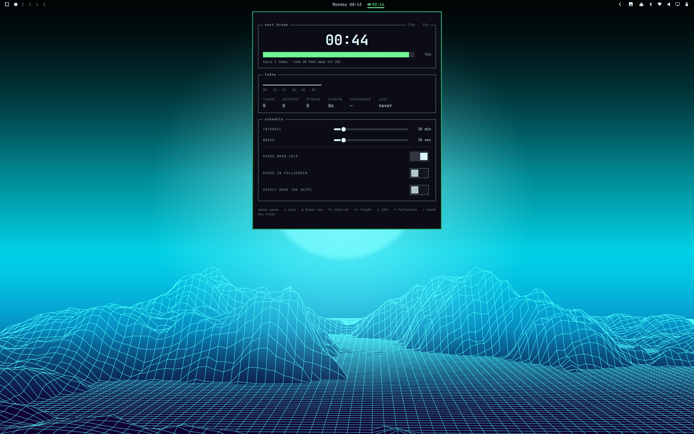
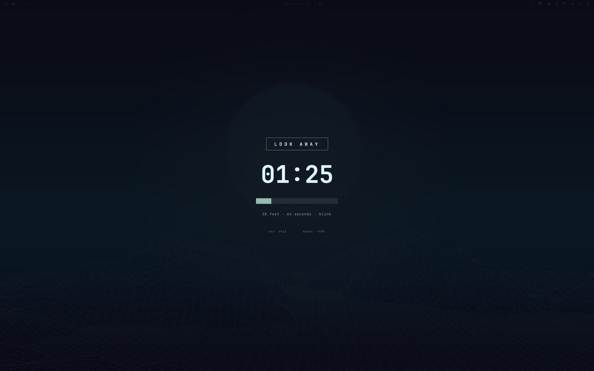

# Omarchy Eye Break

A minimal, native eye-break reminder for [Omarchy](https://omarchy.org).

Every 20 minutes, look at something 20 feet away for 20 seconds. That is the
whole product.

- **No Electron.** QML running inside the `omarchy-shell` process you are
  already running. Nothing new is launched.
- **No accounts.** No network calls, no telemetry, no sync. One local JSON file.
- **No clutter.** One bar glyph, one panel, one break screen.
- **Keyboard-driven.** Every action has a key, including on the break screen.
- **Themed.** No hardcoded colors or sizes; it repaints itself when you run
  `omarchy theme set`.

```
󰈈 12:34
```

---

## Install

```bash
omarchy plugin add https://github.com/shilai-li/omarchy-eye-break.git --enable
```

Or by hand, from a clone:

```bash
cp -r . ~/.config/omarchy/plugins/shilai_li.eye-break
omarchy-shell shell rescanPlugins
omarchy plugin enable shilai_li.eye-break
```

The widget lands on the right of the bar. Move it with `omarchy bar move`.

> Plugins run unsandboxed inside your shell. Read the code before you enable it.

---

## Uninstall

```bash
omarchy plugin remove shilai_li.eye-break
```

This disables the plugin and removes its installed copy. Your local break
history is kept at `~/.local/state/omarchy/eye-break/state.json`; remove that
file separately only if you also want to erase the history.

---

## The interface

### Bar

| | |
|---|---|
| `󰈈 12:34` | running — time to the next break |
| `󰈈 00:47` | due soon — the glyph warms toward your theme's urgent color |
| `󰈈 ▮▮` | on break |
| `󰈉 paused` | paused by you |
| `󰈉 idle` | paused because you stepped away |

**Left click** opens the dashboard · **right click** pauses · **middle click**
takes the break now. On a vertical bar the countdown stacks under the glyph.

### Dashboard

Three boxed sections in the btop idiom — section name cut into the top border,
block-glyph meters, tiny all-caps labels.



```
┌ next break ─────────────────────────────── 20m · 20s ┐
│                                                      │
│                      12:34                           │
│                                                      │
│  ████████████████████░░░░░░░░░░░░░░░░░░░░░░░   38%   │
│  cycle 4 today · look 20 feet away for 20s           │
└──────────────────────────────────────────────────────┘
┌ today ───────────────────────────────────────────────┐
│  ▁▁▂▃▅▇█▇▅▃▂▁▂▃▅▆                                    │
│  23  03  07  11                                      │
│                                                      │
│  TAKEN  SKIPPED  STREAK  SCREEN  ADHERENCE  LAST     │
│  14     2        9       6h 12m  88%        17m ago  │
└──────────────────────────────────────────────────────┘
┌ schedule ────────────────────────────────────────────┐
│  INTERVAL             ▬▬▬▬▬▬▬▬●▬▬▬▬▬▬     20 min     │
│  BREAK                ▬▬▬●▬▬▬▬▬▬▬▬▬▬      20 sec     │
│  PAUSE WHEN IDLE                            [ on  ]  │
│  PAUSE IN FULLSCREEN                        [ off ]  │
│  STRICT MODE (NO SKIP)                      [ off ]  │
└──────────────────────────────────────────────────────┘
  space pause   s skip   b break now   ↑↓ interval   …
```

The graph is breaks per hour over a rolling window ending at the current hour,
so it still says something at 00:30.

| Key | |
|---|---|
| `space` / `enter` | pause / resume |
| `s` | skip this cycle |
| `b` | take the break now |
| `↑` `↓` (or `k` `j`) | interval ± 5 min |
| `←` `→` (or `h` `l`) | break length ± 5 sec |
| `+` `-` | interval ± 5 min |
| `[` `]` | break length ± 5 sec |
| `i` | toggle pause-when-idle |
| `f` | toggle pause-in-fullscreen |
| `r` | clear the history |
| `tab` / `shift+tab` | walk to the neighbouring bar panel |
| `esc` | close |

### Break screen

Fullscreen on every monitor — a break you can sit out by looking at the other
screen is not a break.



```
        ╭───────────────────────────╮
        │      L O O K   A W A Y    │
        ╰───────────────────────────╯

                  00:17

        ████████████████░░░░░░░░░░░░░░░░

           20 feet · 20 seconds · blink

           esc  skip        space  +20s
```

It dismisses itself when the countdown lands; you never have to click anything.
`esc` skips (recorded as a skip). With **strict mode** on, `esc` does nothing.

---

## Settings

Editable from **Setup → Bar**, or by hand in the widget's entry under
`bar.layout` in `~/.config/omarchy/shell.json`.

| key | default | |
|---|---|---|
| `intervalMinutes` | `20` | minutes of screen time between breaks (1–180) |
| `breakSeconds` | `20` | how long to look away (5–600) |
| `showCountdown` | `true` | show `mm:ss` in the bar, or just the glyph |
| `pauseWhenIdle` | `true` | stop the clock when you step away |
| `idleGraceSeconds` | `300` | seconds without input before you count as away (10–3600) |
| `pauseInFullscreen` | `false` | don't interrupt a fullscreen window; retried a minute later |
| `strictMode` | `false` | remove the skip key from the break screen |
| `preNotifySeconds` | `0` | seconds of warning as a desktop notification; `0` is off |

Every value is clamped rather than rejected — a hand-edited `0` gives you the
nearest working number, not a broken widget.

```jsonc
{
  "bar": {
    "layout": {
      "right": [
        { "id": "shilai_li.eye-break", "intervalMinutes": 25, "strictMode": true }
      ]
    }
  }
}
```

---

## Command line

```bash
omarchy-shell shilai_li.eye-break toggle       # the dashboard
omarchy-shell shilai_li.eye-break togglePause
omarchy-shell shilai_li.eye-break pause
omarchy-shell shilai_li.eye-break resume
omarchy-shell shilai_li.eye-break breakNow
omarchy-shell shilai_li.eye-break skip
omarchy-shell shilai_li.eye-break reset        # restart the current cycle
omarchy-shell shilai_li.eye-break status       # JSON
```

`status` is stable and meant for scripting. Branch on `status`;
`remainingSeconds` is always the **work cycle**, which keeps elapsing during a
break, and `breakRemainingSeconds` is the break in flight (`0` otherwise):

```json
{
  "status": "running",
  "remainingSeconds": 754,
  "remainingText": "12:34",
  "breakRemainingSeconds": 0,
  "progress": 0.372,
  "intervalMinutes": 20,
  "breakSeconds": 20,
  "paused": false,
  "pausedBy": "",
  "streak": 9,
  "today": { "taken": 14, "skipped": 2, "adherencePercent": 88 }
}
```

A Hyprland bind:

```
bindd = SUPER CTRL, E, Eye break, exec, omarchy-shell shilai_li.eye-break toggle
```

> Note the two different targets. `omarchy-shell shilai_li.eye-break …` talks to
> the plugin and is what you want. `omarchy-shell shell summon shilai_li.eye-break`
> goes through the shell's panel loader and raises the **break screen**, not the
> dashboard.

---

## How it works

The schedule is **derived, never counted**. A bar surface exists once per
monitor, so a `Timer` inside the widget would give a two-monitor desktop two
drifting countdowns and two break screens.

Instead there is one absolute timestamp on disk:

```
~/.local/state/omarchy/eye-break/state.json
```

Every instance watches that file and computes
`remaining = interval − (now − cycleStartedAt − pausedTime)`. A local clock only
drives repaints. Consequences:

- the countdown survives `omarchy-restart-shell`
- every monitor shows the same number
- the break screen writes the outcome, so the bar's countdown restarts the
  instant the overlay comes down

Some behaviour worth knowing:

- **Idle.** Stepping away pauses the clock. An absence as long as a whole work
  cycle also counts as a break taken — if you were gone for twenty minutes, you
  already had your break. Anything shorter only pauses, because input idleness
  cannot tell *away from the desk* from *reading the screen without typing*,
  and reading is exactly the screen time this plugin exists to interrupt. A
  pause *you* asked for is never cleared by coming back from idle.
- **Suspend.** Waking a laptop does not fire a break that came due while the lid
  was shut. A cycle more than five minutes past due is treated as "nobody was
  here" and starts over.
- **Crash.** A break screen that never reports back (the shell was killed under
  it) is settled as a skip a minute later rather than freezing the countdown.
- **History** is capped at seven days and 600 entries. It is the only thing in
  the file that grows.

---

## Development

```bash
omarchy plugin validate .
QT_FORCE_STDERR_LOGGING=1 /usr/lib/qt6/bin/qmllint -I /usr/share/omarchy/shell BarWidget.qml
bash test/model-test.sh
```

`Model.js` holds all the scheduling, statistics and meter math, and is
deliberately Qt- and locale-free so the test suite runs under plain `node` with
no compositor. Anything needing `Qt.formatDateTime`, a theme color, or a QML
type lives in the `.qml` files.

Saving any file under `~/.config/omarchy/plugins/` hot-reloads plugin code, so
the edit loop is: save, look at the bar.

See [AGENTS.md](AGENTS.md) for the full plugin contract, architecture notes and
house style.

## License

MIT. See [LICENSE](LICENSE).
